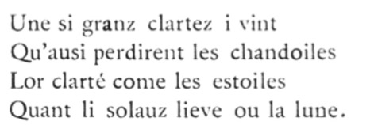

:github_url: https:gi//github.com/Quandela/Perceval_Interop

   Perceval, the Story of the Grail – Chrétien de Troyes (circa 1180)

Welcome to the Perceval Interoperability package documentation!
===============================================================

Perceval_Interop is designed to facilitate a bridge between Perceval, a photonic quantum
computing framework, and several leading gate-based frameworks through an easy-to-use
python API.

It provides converters to translate gate-based quantum circuits from various
frameworks into Perceval’s linear optical circuits using dual-rail encoding.
In addition to universal circuit translation, it enables the conversion of
quantum state vectors across different representations.

**Supported Frameworks**
-------------------------

.. list-table::
   :header-rows: 1
   :widths: 25 25 50

   * - Framework
     - Type
     - Description
   * - **Qiskit**
     - Gate Circuits, Quantum States
     - IBM's open-source quantum computing framework
   * - **myQLM**
     - Gate Circuits
     - Atos Quantum Learning Machine framework
   * - **cQASM**
     - Gate Circuits
     - Common Quantum Assembly Language, parsed by the ``libqasm`` library
   * - **QuTiP**
     - Quantum States
     - Quantum state vector conversion and manipulation

.. toctree::
   :caption: Documentation
   :maxdepth: 2
   :hidden:

   getting_started

.. toctree::
   :caption: Tutorials
   :maxdepth: 2
   :hidden:

   notebooks/Qiskit_converter
   notebooks/Statevector_converter
   notebooks/Resources_estimator
   notebooks/Myqlm_converter
   notebooks/Cqasm_converter

.. toctree::
   :caption: Code Reference
   :maxdepth: 2
   :hidden:

   reference/qiskit
   reference/myqlm
   reference/cqasm
   reference/statevectorconverter
   reference/circuitgraph
